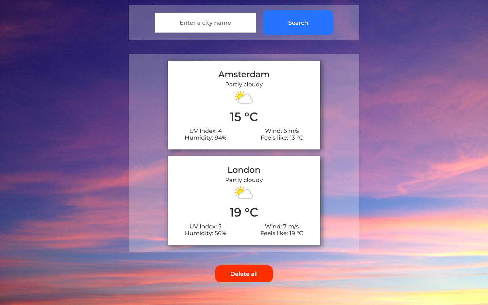

# WeatherApp

It’s a simple weather app. Just enter a city name and get a current forecast.  
The app uses https://www.weatherapi.com/. 

## Result:

https://goncharovastacy.github.io/WeatherApp/

## Technologies:

<code></code>
<code></code>
<code></code>
